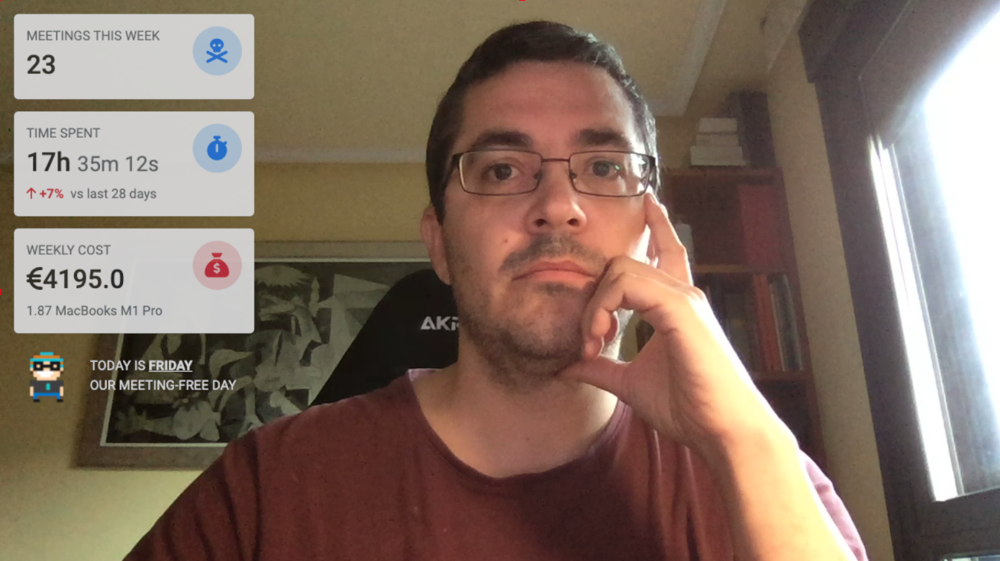

# Meetings are Toxic

## How to run it

You need to install [Node.js](https://nodejs.org/en/) before installing the deps and running the server:

```bash
npm install
node index.js
```

You can integrate it with a virtual cam such as [OBS](https://obsproject.com/) to use it as an overlay in your meetings.



## TODO
- Use Outlook REST API https://learn.microsoft.com/en-us/graph/outlook-get-shared-events-calendars instead of mocking the response.